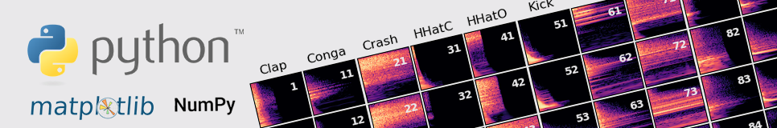
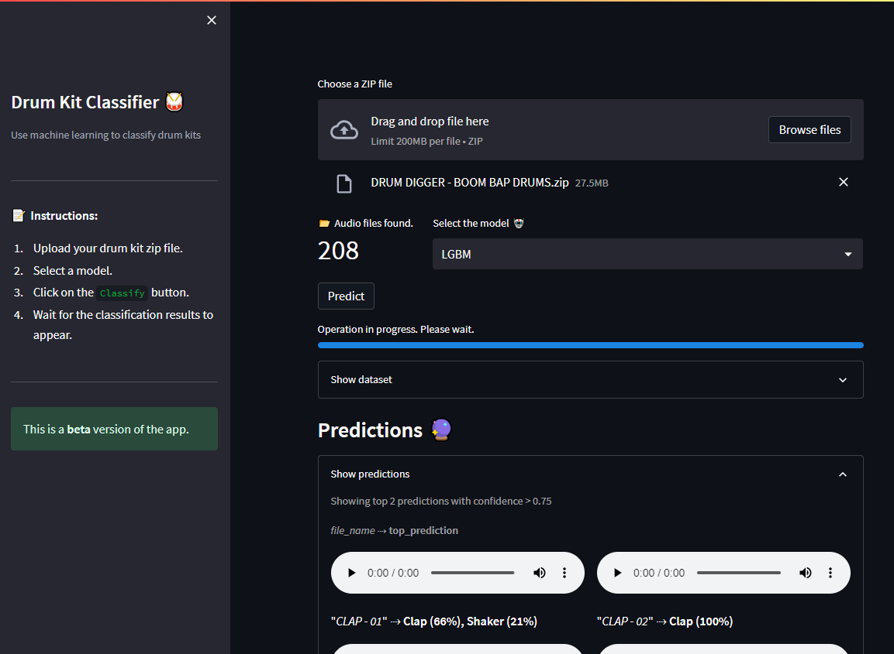

<div align="center">
  <a href="https://github.com/othneildrew/Best-README-Template">
    
  </a>
<h1 align="center">DrumClassifier</h1>

  <p align="center">
    Use AI to classify percussive sounds !
    <br />
    <a href="https://github.com/othneildrew/Best-README-Template"><strong>Demo Streamlit</strong></a>

  </p>

</div>



## About

In this repository, you will find the code for my final year project at CY Tech. 

The goal of this project is to classify percussive sounds using AI without use Deep Learning. 
The dataset used is the [here](https://drive.google.com/drive/folders/1xdZt_hiaQ1yqI1Vgrc9BKETrCNc-1NyZ?usp=sharing) which contains 14 different classes of percussive sounds. 

<p align="center">


</p>
The best model obtained is a LightGBM model with a 0.89 accuracy and a 0.88 F1-score.
Few models (LGBM, RF, SVC) are then saved and used in the "DrumClassifier" application to classify percussive sounds.


## Application

### Description

...

On the streamlit demo, you can generate a text by :

1. **...** ...


### Requirements

````
pip install -r requirements.txt
````

### Execution

1. Make sure you have installed the above prerequisites
2. Download or clone this repository to your computer
3. Open a terminal and go to the application directory
4. Run the command `streamlit run app.py`.

You should now see the application running 🚀 !

### Screenshots




## Acknowledgments

* [Valerio Velardo]() (AI audio/music engineer) for his courses and his all [YouTube channel](https://www.youtube.com/c/ValerioVelardoTheSoundofAI) which helped me a lot in understanding the topic of AI in audio processing.
* [Tensorflow](https://www.tensorflow.org/)
* [Streamlit](https://streamlit.io/)

<div align="right">

<h2 align="right">Contact</h2>

  <p>📬 mlamali.saidsalimo [ at ] gmail.com 📬</p>
  <p>Find me on <a href="https://www.linkedin.com/in/mlamalisaidsalimo/">LinkedIn</a> or read me on <a href="https://medium.com/wanabilini">Medium !</a></p>

 </div>


